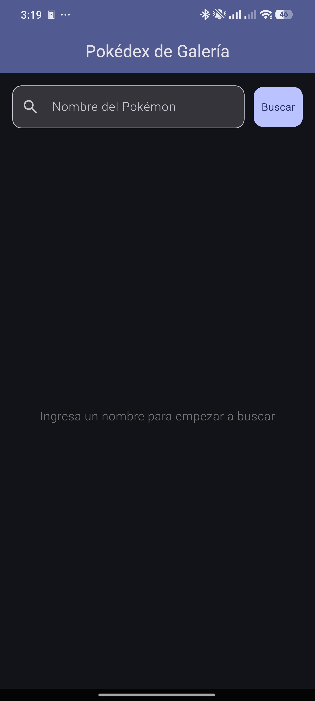
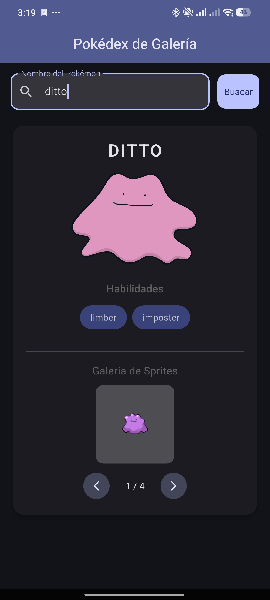

# Pokédex de Galería (Gallery App)

Una aplicación móvil desarrollada en Flutter que funciona como una Pokédex. Permite a los usuarios buscar información sobre diferentes Pokémon, ver sus habilidades y disfrutar de una galería interactiva de sprites.

## Características

- **Búsqueda de Pokémon:** Permite buscar y encontrar Pokémon por su nombre de manera rápida.
- **Detalles del Pokémon:** Muestra el nombre, la imagen principal de alta calidad y una lista con sus habilidades.
- **Galería de Sprites interactiva:** Una función de galería donde se pueden visualizar múltiples sprites del Pokémon buscado, con botones de navegación (anterior y siguiente) e indicador de cantidad.
- **Modo Claro / Oscuro:** Soporte para cambiar dinámicamente el tema de la aplicación mediante botones flotantes.
- **Manejo de Errores y Carga:** Muestra un indicador de carga mientras se obtienen los datos y notifica al usuario en caso de que el Pokémon buscado no exista.

## Paquetes Utilizados

El proyecto utiliza los siguientes paquetes de Flutter (definidos en `pubspec.yaml`):

- `http`: Para realizar peticiones HTTP a la API.
- `flutter_svg`: Para renderizar imágenes en formato SVG directamente desde la red.
- `cupertino_icons`: Para contar con una amplia gama de iconos.

## Capturas de Pantalla

A continuación, se muestran algunas vistas de la aplicación:

|                    Pantalla Principal                    |           Búsqueda de un Pokémon           |                 Pokémon No Encontrado                 |
| :------------------------------------------------------: | :----------------------------------------: | :---------------------------------------------------: |
|  |  |  |

## Ejecución del proyecto

Para ejecutar el proyecto localmente, asegúrate de tener instaladas las dependencias:

```bash
flutter pub get
flutter run
```
